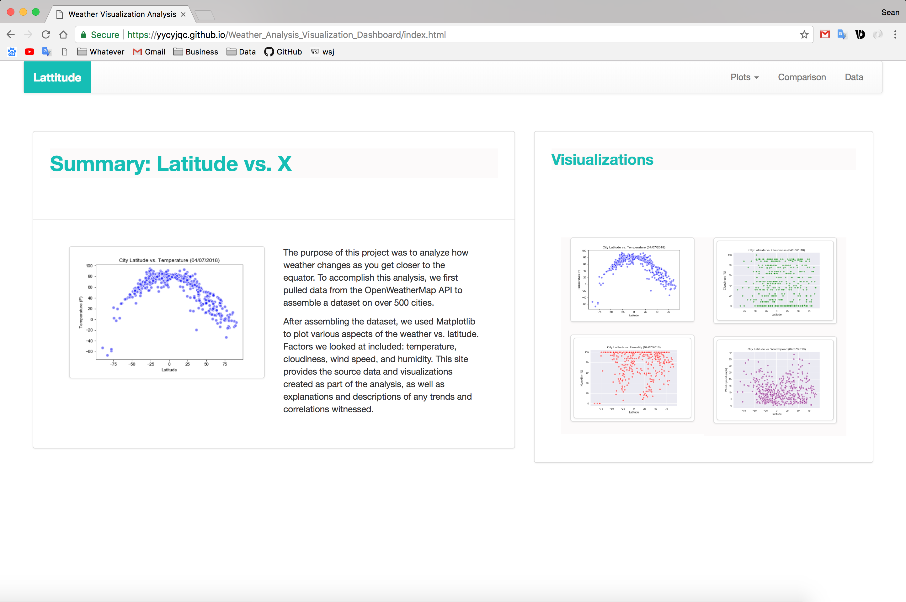

# Weather Visualization Dashboard

## Website address: 

Click [here](https://yycyjqc.github.io/Weather_Analysis_Visualization_Dashboard/) to see the project.

---

## Findings

- Latitude vs. Max Temperature

  > As expected, the weather becomes significantly warmer as one approaches the equator (0 Deg. Latitude). More interestingly, however, is the fact that he northern hemisphere tends to be warmer this time of year than the southern hemisphere. This may be due to the tilt of the earth at the time of the yar this data was gathered.

- Latitude vs. Cloudiness

  >What causes the sky to be cloudy? 
  >
  >*If skies are clear, more heat reaches the earth's surface. However, if skies are cloudy, some of the sun's rays are reflected off the cloud droplets back into space. Therefore, less of the sun's energy is able to reach the earth's surface, which causes the earth to heat up more slowly. *
  >
  >**However, according to the diagram above, it looks like there are no correlations between the latitude and cloudiness.** 

- Latitude vs. Humidity

  > One interesting finding is when on the equator, it's much more humidity than other two hemispheres. 
  >
  > The northern hemisphere tends to be more humidity this time of year than the southern hemisphere, especially around N25° and N75°. 

- Latitude vs. Wind Speed

  > One fact we can easyily figure out: the higher the dimension, the faster the wind speed.

## Technology Stack Used

- Python
- Javascript/CSS